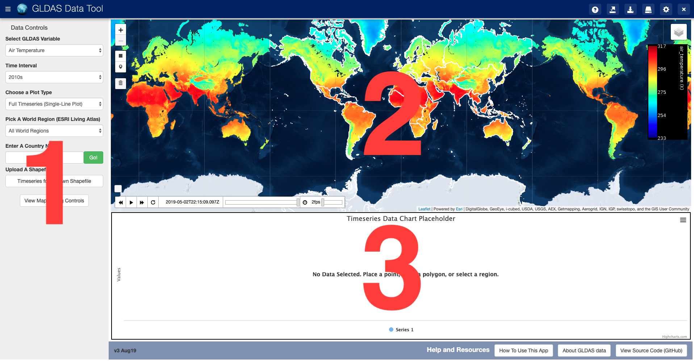
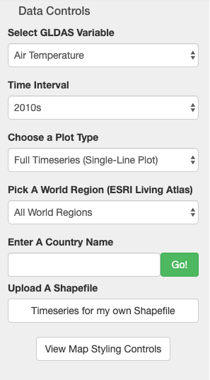
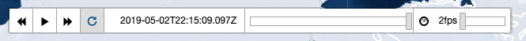
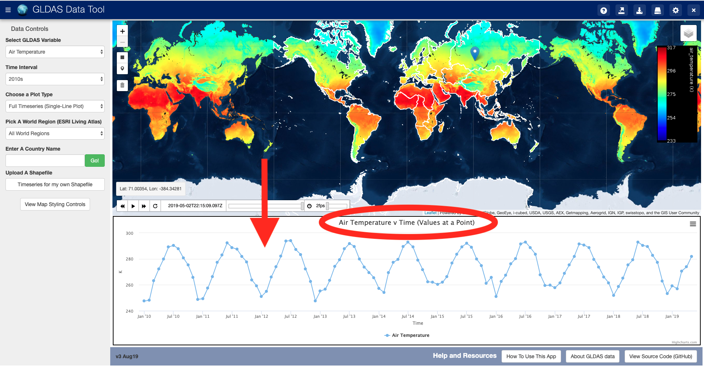
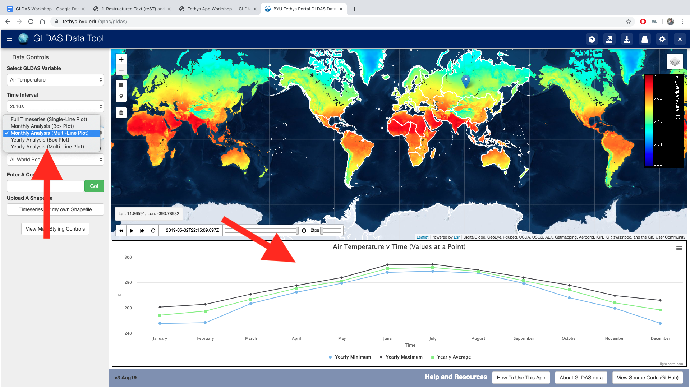
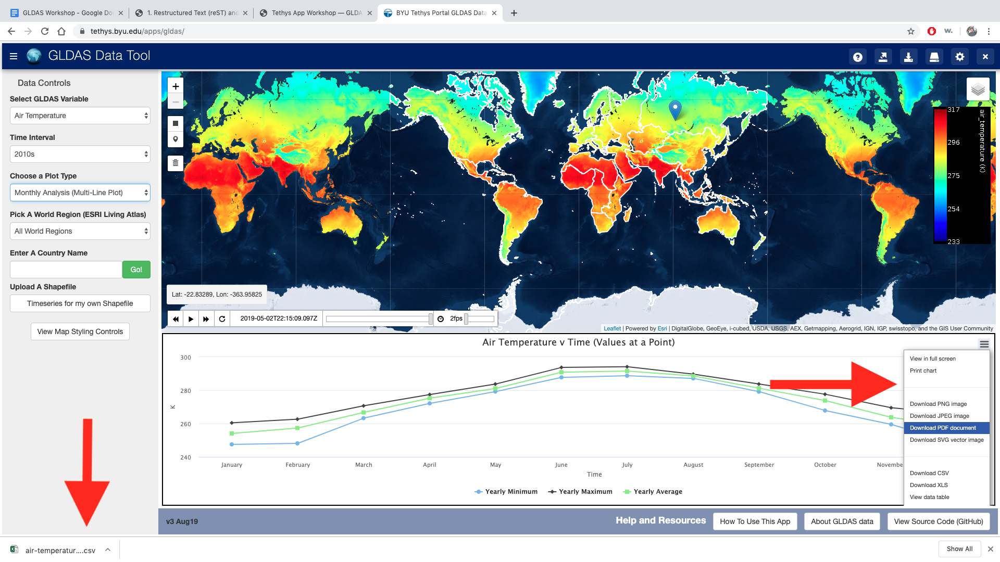
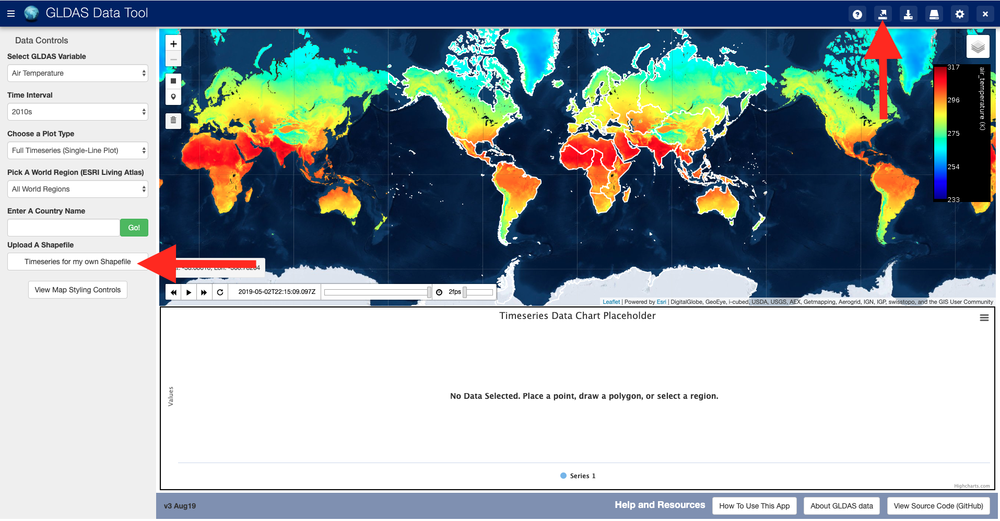
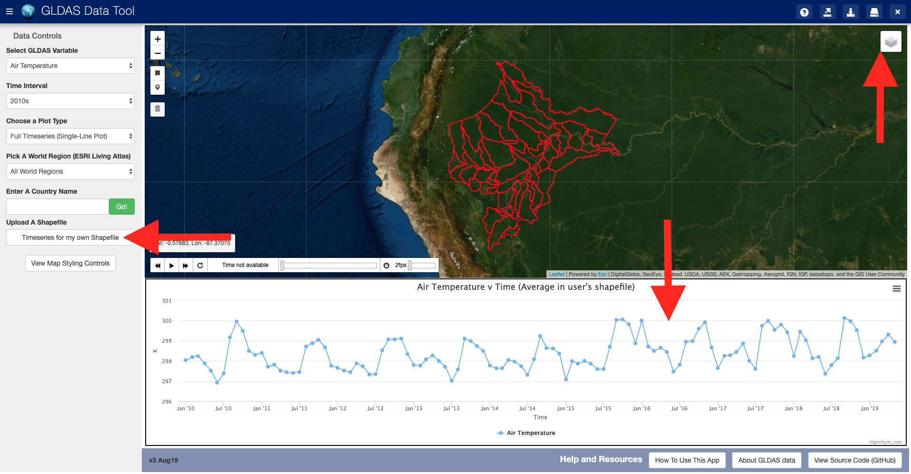
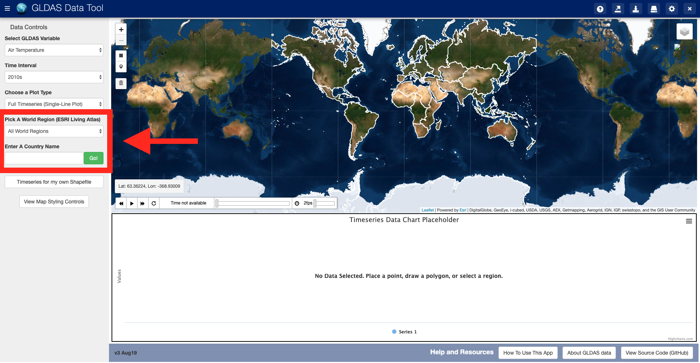
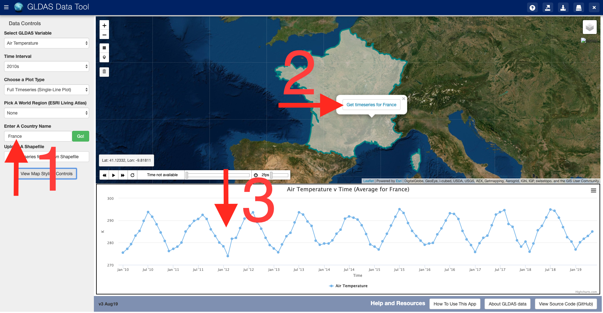

Tethys App Workshop
===================

This workshop is available as a Google Doc and a Google Collaboratory Notebook. Please ask the workshop instructor to
provide you with access to them.

Open the App
------------
The GLDAS Data Tool is available for free use at `tethys.byu.edu <https://tethys.byu.edu>`_ where you will be asked to
create a free account. Choose the GLDAS Data Tool from the list of available apps.

On the main page of the app you will see 3 regions:

1. A column labeled Data Controls for changing the map and chart, and their appearance.
2. A map showing the GLDAS data
3. A space reserved for timeseries charts. This will remain blank until you generate a chart.

Data and Display Controls
-------------------------
The top half of the controls column on the left (#1 in the diagram above) are labeled “Data Controls”. The lower
section has controls for customizing the appearance of the maps and charts. Click “View Map Styling Controls” to open
that menu.

* Select a GLDAS variable. Pick one of more than 30 variables.
* Select Time interval. The options are each decade from the 1950’s through the present, or All Available Times
* Plot Type: after generating a series, you may use this to toggle through the options for plotting the data.
* Pick a World Region. Listed are all 25 of the United Nations’ Country Groups. Pick a country from the list to view it
  on the map
* Enter A Country Name. Type the full, correctly spelled and punctuated name of a country and press go to see it’s
  boundaries on the map.
* Upload a shapefile. Click timeseries for my own shapefile to open a menu for uploading a shapefile and then to
  generate a timeseries for the polygons you uploaded. (Must be in WGS 84, EPSG 4326)
* View Map Styling Controls. Click this to open a long menu of styling controls for the GLDAS, Shapefile, and Boundary
  data on the map.

Animating the Map
-----------------
After you have chosen the appropriate combination of variable and time settings, look at the animation controls found
on the bottom left of the map (section 2). Turn on the replay button (highlighted in this figure) then press play. The
fps slider on the right changes how fast the animation plays.

Generating and Saving a Timeseries
----------------------------------
To generate a timeseries you may either:

#. Place a point on the map (use the point icon on the left of the map)
#. Draw a bounding box (use the box icon on the left of the map)
#. Use the “timeseries for my shapefile” button to upload then generate series
#. Choose a Country or World Region boundary then click on their icons on the map

To save your timeseries, use the hamburger style menu button found on the top-right of the chart.

Timeseries for Point/Bounding Box
---------------------------------
1. To get a timeseries at a point or a polygon, use the drawing tool. Click the point icon then click anywhere over on
   land in the map. Or, click the box icon then click and drag across the map to draw a box.

.. image:: _static/ex-pt-1.png

2. Read the results in the chart. Verify it looks as expected.

3. If you want, you may choose a different style of chart. In the controls menu on the left there is a control for
   switching how the data are plotted. There are a total of 5 options. 1 shows the unfiltered timeseries data, the
   other 4 show the data as a timeseries aggregated by month or year and as either a column chart or a bar chart.

4. After choosing the format of the chart you want, use the controls on the right side of the chart container to save
   either an image of the chart or the raw data as a csv.

Timeseries by Uploading a Shapefile
-----------------------------------
1. You can use the app's interface to upload a shapefile, view it on the map, and use it to generate timeseries data.
   To upload a shapefile, use the button indicated on the top right. If you press the button to generate a timeseries,
   you will be redirected to the upload page.

2. Your shapefile MUST be in the WGS 1984/EPSG 4326 geographic coordinate system and MUST contain at least the shp,
   shx, prj, dbf components of the shapefile. The shapefile MUST contain only polygon data if you wish to use it to
   generate timeseries data. The polygons should be larger than the 1/4 degree resolution GLDAS data.

.. image:: _static/ex-shp-2.png

3. After uploading your shapefile, the map will zoom to your shapefile. Use the layer menu on the top right of the map
   to remove other layers. If the shapefile looks correct, press the "Timeseries for my own Shapefile" button to get a
   chart for your file. Press "View Map Styling Controls" and use the "Boundary" options to change the styling of your
   shapefile. If no shapefile or charts appear, something is wrong with the format of your shapefile.

Timeseries with Countries and World Regions
-------------------------------------------
1. To generate a timeseries for a predefined world region, you can use the World Region and Country Name controls found
   on the left hand side of the app. The list of world regions are the same names and geographic areas as the United
   Nations country groupings. Every country is available but you must type the name of the country rather than search a
   list of every country.

2. Pick a region or country. If you type a country name, use the prompted spelling and capitalization that appear below
   the input box. After you click a region or hit 'Go!' next to the country name, the map will zoom to the location you
   chose. To generate a timeseries for that region, click on the region on the map and then press the button that
   appears in the pop-up bubble.

Important things to know
------------------------
* If you change variables or times, the chart should regenerate automatically.
* If you want to upload a different shapefile after already uploading and using a shapefile, you can reopen the
  uploading interface by clicking on the upload icon on the top right of the app. Your shapefile is saved for the
  duration of your session.
* If the data you want isn’t on the map, it may have been turned off. Open the map controls, the white box on the top
  right of the map, and use the check boxes.
* You may use the map controls, the white box on the top right of the map, to switch basemaps. You may choose Imagery
  or Terrain maps, with or without labels.

